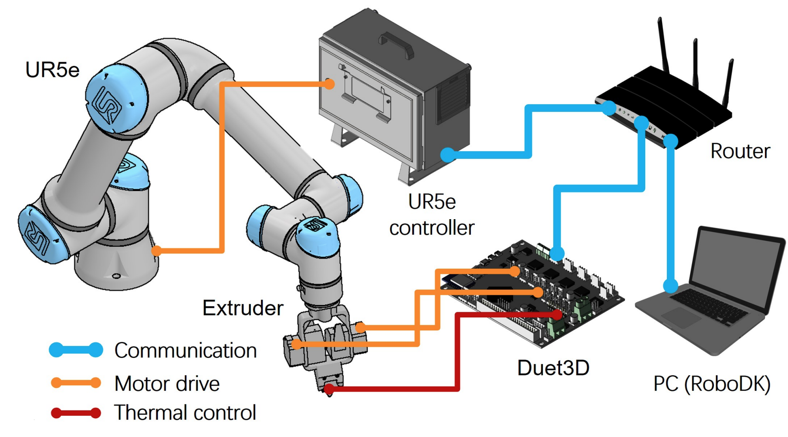

### Hardware_support_for_Curved_RoboFDM
## Abstract
This project provides hardware support for [Support_Generation_for_Curved_RoboFDM](https://github.com/zhangty019/Support_Generation_for_Curved_RoboFDM).
## Structure

## Usage

**Step 0:**
First, it is necessary to download **RoboDK** and establish an environment that corresponds to the robot arm and real-world working conditions.

**Step 1:**
Continue translating: Double-click the [InputWaypointSocketExtruderTree](InputWaypointSocketExtruderTree.py) file to generate the corresponding **toolpath file**. Right-click on "Show instructions" to view the specific path. Double-clicking the **toolpath file** allows the robot arm to simulate the execution of the file in **RoboDK**.

**Step 2:** Right-click on the **toolpath file** and select **"Generate robot program"** to create an offline UrScript executable for UR robots.

**Step 3:** Replace the robot's post-processor with the [Universal_Robots_SocketExtruderTree.py](Universal_Robots_SocketExtruderTree.py) file to adapt to 3D printing extrusion control with Duet3 boards. 

**Step 4:** For instructions on how to configure the Duet3 board, please refer to: [link](https://docs.duet3d.com/User_manual/Overview/Getting_started_Duet_3_MB6HC), eg. [configTree](configTree.rar)

**Step 5.1:** The generated script file can be directly transferred to the robot via TCP/IP protocol. Please note, before running the [sendInterpreterFromFile.py](sendInterpreterFromFile.py) file, run the [global.script](global.script) to input global variables and socket Duet3 board, then switch the robot to [interpreter mode](interpreterMode.script) first. This connection method is suitable for teach pendants with SW5.1 and above, as well as UR e-series robots, but not applicable to the cb3 series. Here is an example of the [script file](mergeLayer33.script).

**Step 5.2:** If a cb3 series robot is being used or there is no desire to connect the robot via a network, the script can be imported directly using USB transfer. By importing the script into an empty program on the teach pendant, the robot can run the script directly. This method is relatively simple and suitable for beginners, but it is not recommended for importing files larger than 1000kb, as it may cause the teach pendant to crash.

**Step 6:**  To run the .PY file, use the following command and modify it according to your own environment: **../roboDK/Python37/python.exe ../InterpreterFromFile.py 192.168.4.3 ../mergeLayer33.script -v**

Then enjoy yourself!

### End
